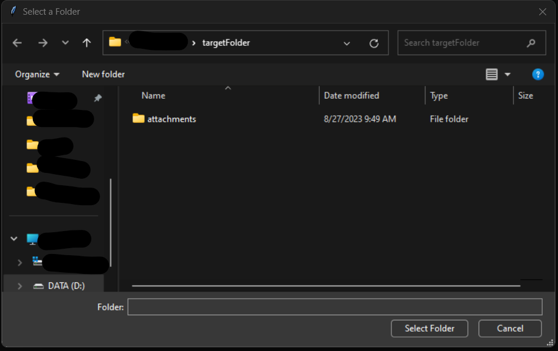

# IDAK

The IDAK is a tailored Python utility that simplifies the task of sending bulk personalized emails. It extracts recipient data from an Excel file and dispatches emails with the option to include attachments. This tool is crafted to aid in various email-based communication needs, such as newsletters, company announcements, and promotional campaigns.

## Features

- **Automated Email Sending**: Facilitates sending emails in bulk, driven by an Excel data source.
- **Excel File Integration**: Employs recipient details from Excel for personalized emails.
- **Attachment Capabilities**: Allows inclusion of specific files as email attachments, as listed in the Excel file.
- **Email Personalization**: Supports individualized email subjects and bodies tailored to each recipient.

## Prerequisites

To effectively use this application, you will need:

- Python 3.6 or newer installed on your computer.
- The necessary Python libraries which can be installed as described below.

## Installation

1. Ensure you have a copy of the application files on your local system.

2. Open a command prompt or terminal and navigate to the directory where the application is stored.

3. Install the required Python packages using the following command:

   ```sh
   pip install -r requirements.txt
   ```

## Configuration

Before running the application, make sure to set it up with your specific details:

1. Open the `config.py` configuration file present in the root directory of the application.

2. Input the appropriate values:
   - `SENDER_EMAIL`: Your email address to send emails from.
   - `EMAIL_PASSWORD`: An app-specific password or OAuth token for authentication.
   - `EXCEL_FILE_PATH`: The full path to your Excel file containing the email details.
   - `ATTACHMENTS_DIR_PATH`: The directory path where email attachments are stored.

## Usage

Once the application is configured, follow these steps to use it:

1. Launch the application through the command line or terminal:

   ```sh
   python base.py
   ```

2. If required, a graphical user interface will guide you to select the necessary files and directories.

3. The tool will then process the Excel spreadsheet and send personalized emails to each recipient, including their respective attachments.

## Security and Testing Practices

### Security Practices

- **Password Protection**: Avoid storing passwords in plain text. Utilize environment variables or secure credential stores.
- **Authentication**: Employ app-specific passwords and enable two-factor authentication for email accounts.
- **Encryption**: Use TLS/SSL connections when sending emails to protect data in transit.
- **Code Review and Audits**: Regularly audit the codebase for security vulnerabilities and keep dependencies up to date.

### Testing Practices

- **Unit Testing**: Implement unit tests for all functions to ensure code reliability and catch regressions.
- **Mocking External Services**: Use mocking to simulate external services for testing email sending and file operations.
- **Continuous Integration (CI)**: Set up a CI pipeline to run tests automatically on code changes.
- **Code Coverage**: Strive for high code coverage to validate that tests are comprehensive.

Unit tests can be run with:

```sh
python -m unittest unit_tests
```

Refer to the `unit_tests.py` file and `tests` directory for all test cases and sample files respectively.

## Support and Maintenance

If you encounter any issues or require assistance with this application, please contact the IT support team or the designated personnel responsible for this tool within your organization.

## License

This software is intended for internal use only. Unauthorized distribution or reproduction is prohibited.

## Application Screenshots

Here are some examples of the application in action:




For further documentation or detailed operational procedures, please refer to the included `docs` directory or contact the development team.